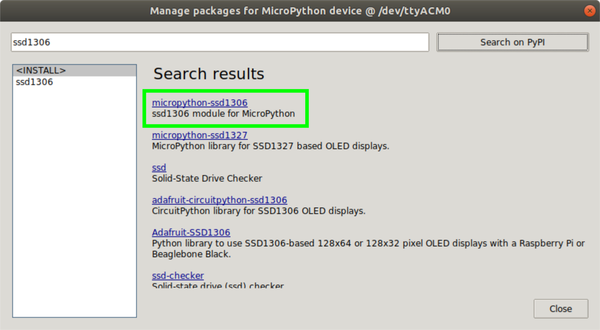

# Build a reaction game
Now lets build a small gamge
* The game is a two player reaction game, whoever presses the button first and faster wins the game 

## Hooking up the OLED display 
* The OLED display uses the i2c protocol that was just described previously
* The raspberry pi pico has a few pins that support the i2c protocol 
* We are going to use the pins numbered 1 and 2 , these are internally GPIO 0 and 1 
* So now connect the raspberry pi pico to the ground and the 5v pins 
* Now the next step is to use the jumper cables to connect the Pico pins 1 and 2 to the OLED display 

## Writing the code 
* Before we write any code we need some special code that we need to download a library 
    * Click on the Tools window in the Thonny IDE 
    * Now Click on Manage Packages
    * Now in the dialog box search for `micropython-ssd1306` and then once you find this click on install
    
    
## Now lets try to print something  on the OLED display 
```py
from machine import Pin, I2C
from ssd1306 import SSD1306_I2C
import time
```
* Let's pull in the libraries that we will be needing 

```py
WIDTH =128 
HEIGHT= 64
i2c=I2C(0,scl=Pin(1),sda=Pin(0),freq=200000)
oled = SSD1306_I2C(WIDTH,HEIGHT,i2c)
```

* The next step is to start by writing the text on the OLED display, turn on the LEDs in that particular pattern that will write the text

```py
while True:
    oled.fill(0)
    oled.text("Hello Python", 0, 0)
    oled.show()
```

* Now let's try changing the co-ordinates of the text to print , try seeing how the text changes 


## Building the reaction game 
* We earlier learnt how to use a pushbutton, Now Let's combine that with the knowledge of the OLED display to build a small game 
* Our game will have 2 buttons , one for player 1 , other for player 2 . Whoever presses the button first, wins the game.


